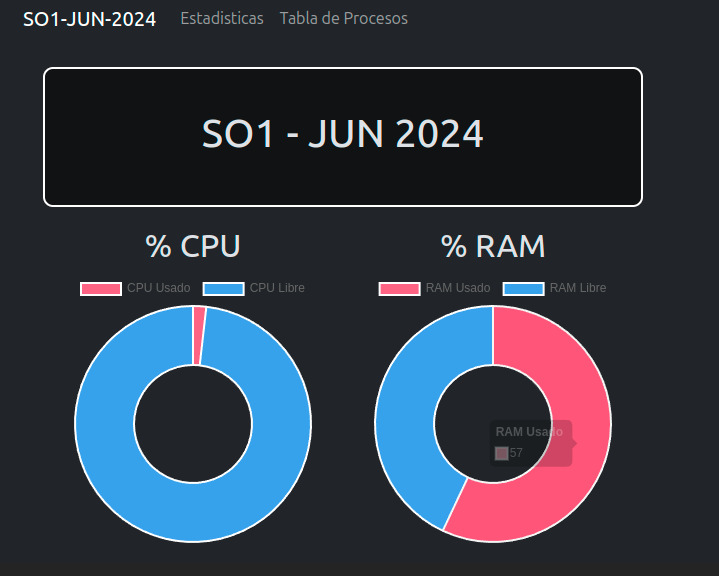

# MANUAL TECNICO

## Resumen

En este proyecto se implemento un sistema integral de monitoreo de recursos del sistema y gestion de procesos. Para lograr esto, se utilizaron diversas tecnologías y lenguajes de programacion. El resultado final es un sistema que proporciona informacion vital sobre el rendimiento del computador, los procesos en ejecucion y su administracion, todo ello a traves de una interfaz de usuario intuitiva y amigable.

Para lograr lo mencionado anteriormente, se empleo Docker Compose, este mismo para dockerizar el frontend desarrollado con React como el backend implementado con Go, aprovechando las funcionalidades de las goroutines de Go para una gestión eficiente de procesos. Además, se utilizo una imagen de Docker de MongoDB, obtenida desde Docker Hub, para gestionar la base de datos.

Una vez que cada componente fue dockerizado y funcional de manera individual, se procedio a integrar todo en un entorno de desarrollo unificado. Todo el sistema fue dockerizado en su conjunto y las imagenes resultantes fueron subidas a Docker Hub. Posteriormente, se desplego el sistema en una maquina virtual con Ubuntu Server. El puerto 80 fue expuesto para el frontend, permitiendo así acceder al sistema desde cualquier maquina en la red.

## Web UI

Para el desarrollo de la interfaz de usuario se utilizo React, la cual es una biblioteca de JavaScript para construir interfaces de usuario. 

Se utilizaron varias dependecias para desarrollar el frontend, asi como librerias para graficar. Se utilizo router para tener varias paginas en un header y así poder navegar entre varios entornos. A continuación se enlistaran todas las librerias que se utilizaron en el proyecto:

1. Bootstrap (^5.3.2)
2. Chart.js (^4.4.1)
3. React (^18.2.0)
4. React Bootstrap (^2.10.1)
5. React Icons (^5.0.1)
6. React Router Dom (^6.22.0)
7. React Toastify (^10.0.4)
8. Vis-Data (^7.1.9) y Vis-Network (^9.1.9)

A continuacion se detallan componentes que conforman el frontend:

### Estadisticas:

En este componente se muestra el porcentaje de memoria RAM utilizada y el porcentaje de CPU utilizado, representados mediante gráficas de pie.

### Tabla de Procesos

En este componente se muestra una tabla que lista todos los procesos del CPU. La tabla incluye las siguientes columnas: PID, name, user, state, RAM y un botón de acciones nombrado actions. Al hacer clic en el botón de acciones, se despliegan todos los procesos hijos, si existen.

En este componente tambien se pueden buscar, crear y eliminar procesos.

## Nginx 

Nginx es un servidor web de código abierto, altamente eficiente y ligero, así como un servidor proxy inverso y un gestor de servidores HTTP. Originalmente fue creado para resolver los problemas de concurrencia y alto rendimiento asociados con los servidores Apache HTTP Server. Este fue implementado para desplegar el frontend en el puerto 80.

Algunas características clave de Nginx son:

1. Alto rendimiento
2. Balanceo de carga
3. Proxy inverso
4. Servidor HTTP

## Base de Datos

MongoDB se utiliza como el sistema de gestion de bases de datos para almacenar y administrar datos relacionados con el sistema. Se utiliza una imagen de Docker de MongoDB, que se obtiene de Docker Hub. Esto asegura la consistencia y facilidad de implementacion en diferentes entornos.

## Backend

El backend fue contruido con Golang. Se realizo una API con el fin de manejar varios endpoint y poder dar respueta a varias consultas.

Fueron creados 4 endpoints, los cuales son detallados a continuacion:

### /api/estadisticas

En este endpoint se llama a la funcion "getEstadisticas", la cual realiza un cat a los modulos ya instanciados en el directorio /proc. Los datos obtenidos a través del modulo, que incluyen el porcentaje de memoria ram utilizada y cpu utilizado en la PC, se envían en formato JSON a traves de HTTP.

### /api/procesos

En este endpoint se llama a la funcion "getProcesos", la cual realiza un cat a los modulos ya instanciados en el directorio /proc. Los datos obtenidos a través del modulo, que incluyen todos los procesos ejecutados en la PC, se envían en formato JSON a traves de HTTP.

### /api/procesos/crear

Este endpoint permite crear un nuevo proceso en el sistema, para el cual llama a la funcion "crearProceso" en donde se crea un comando utilizando exec.Command("sleep", "infinity"), que ejecuta un proceso de sueño infinito en el sistema. Luego se obtiene el PID y el estado del proceso recien creado y se envia en formato JSON a traves de HTTP.

### /api/procesos/eliminar/:pid

Este endpoint permite detener un proceso en el sistema, para el cual llama a la funcion "detenerProceso" en donde se crea un comando utilizando exec.Command("kill", "-9", pid), que envía una señal SIGKILL (señal 9) para forzar la terminación del proceso especificado por el PID. Luego se crea una respuesta JSON que incluye el estado de la operacion y un mensaje indicando que el proceso ha sido detenido y se envia en formato JSON a traves de HTTP.

### Modulos de Kernel

Los modulos de kernel se crean a traves de codigo en C, estos son la base de las paginas estadisticas y procesos. Debido a que por medio de estos modulos se obtiene la informacion del cpu y ram. Se deben instanciar con "sudo insmod cpu_so1_1s2024.ko" y "sudo insmod ram_so1_jun2024" para poder obtener la información del directorio /proc.

1. Modulo CPU

2. Modulo RAM
   

## Dockerizacion

La dockerizacion simplifica el proceso de desarrollo y despliegue de aplicaciones al empaquetar cada componente en contenedores independientes. Esto permite ejecutar la aplicación de manera consistente en cualquier entorno. Con Docker Compose, definimos la configuración de los servicios en un archivo YAML, facilitando su gestion y despliegue.

Para nuestra aplicacion se dockerizan los siguientes servicios:

### Database

Esta es una imagen de docker hub, la cual se llaman sus servicios y se crea un volumen para la persistencia de datos.

### Backend

Este por se local se debe crear un dockerfile para empezar y despues se sube al dockerhub personal para poder ser descargado sin importar cual sea el dispositivo.

Este se referencia en el docker compose para poder dejar todo en una misma red.

### Frontend

Este lleva un proceso mas complejo debido a que se necesita desplegar en el puerto 80, para esto se utilizo nginx, y se dockerizo de la siguiente manera:

#### nginx.conf

#### Dockerfile

#### Dockercompose

### Servicios adicionales

## Construido con

_Para la creacion del proyecto se utilizaron los siguientes lenguajes:_

* [C](https://www.bloodshed.net/) - Usado para la cracion de los modulos.

* [Golang](https://go.dev/) - Usado para la cracion del backend.

* [React](https://react.dev/) - Usado para la creacion frontend.

## Autores

* [Pedro Luis Pu Tavico](https://github.com/luis-tavico)

* [Oscar Eduardo Morales Girón](https://github.com/Racs0XD)